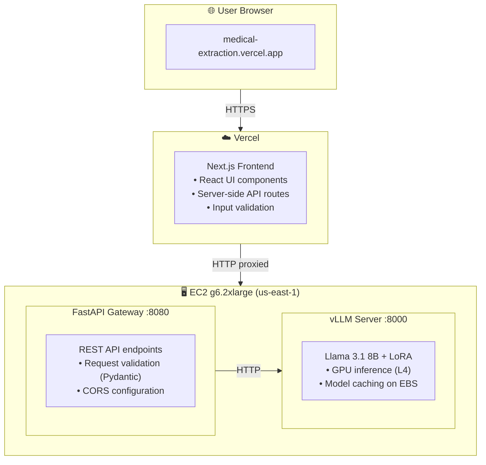
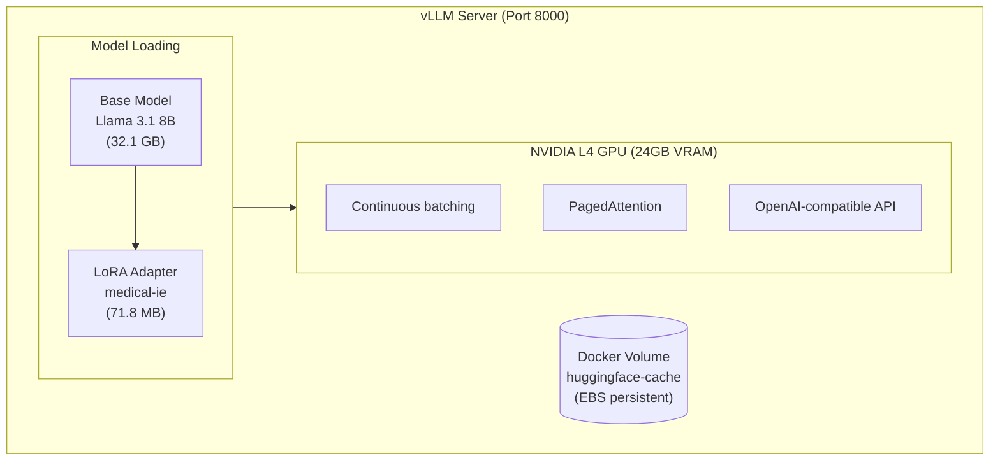
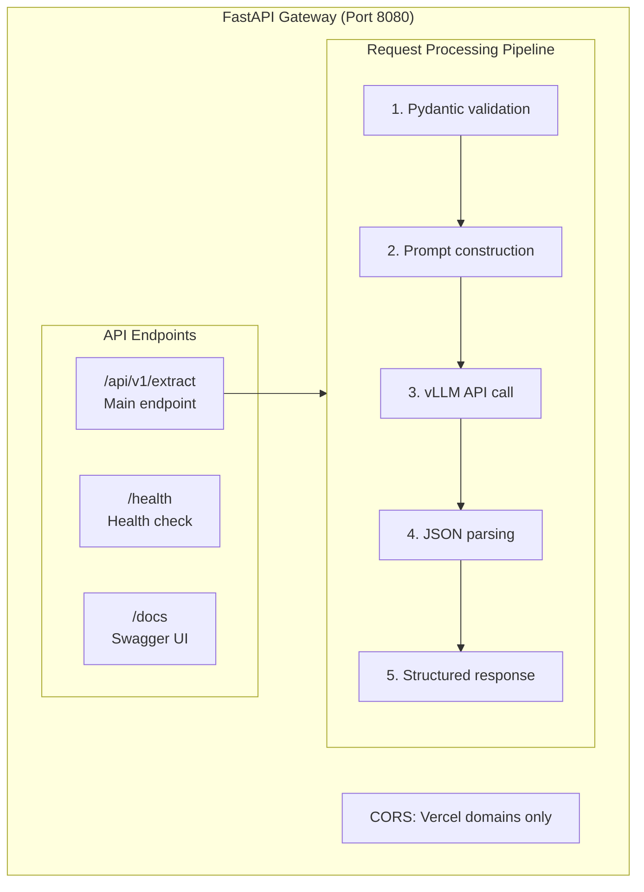
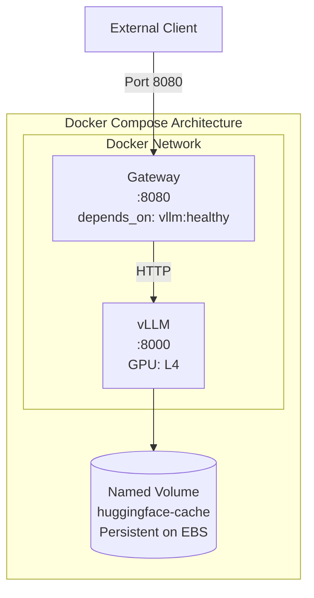
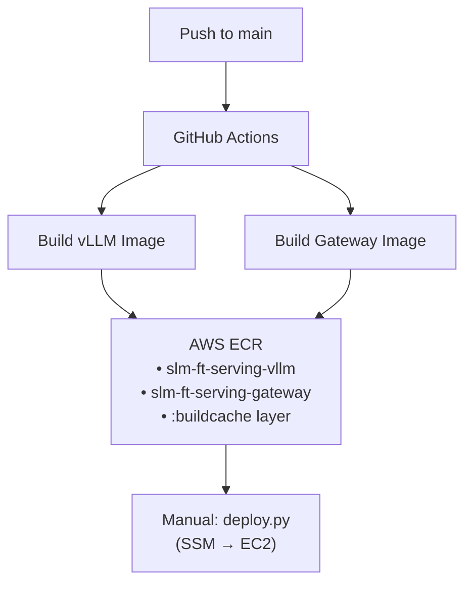
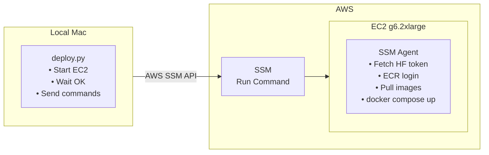

# Medical Information Extraction - Backend Server

> **Backend infrastructure for AI-powered medical cancer information extraction using fine-tuned Llama 3.1 8B**

[](https://medical-extraction.vercel.app)
[](https://github.com/longhoag/slm-ft-serving/actions)
[](https://aws.amazon.com/)
[](https://www.docker.com/)

---

## 🎯 Overview

This repository contains the **backend infrastructure** for a medical information extraction system that uses a **fine-tuned Llama 3.1 8B model** (qLoRA 4-bit quantization) to extract structured cancer-related entities from clinical text.

The system serves as an AI-powered medical assistant that can parse unstructured clinical notes and return structured data including cancer type, stage, gene mutations, biomarkers, treatments, responses, and metastasis sites.

**🌐 Live Application**: [https://medical-extraction.vercel.app](https://medical-extraction.vercel.app)

**📱 Frontend Repository**: [slm-ft-serving-frontend](https://github.com/longhoag/slm-ft-serving-frontend)

---

## 🏗️ Architecture



> ⚠️ **Note**: This is an experimental project. The EC2 backend server may not be running at all times to save costs (~$1/hour for GPU instance). If the demo is unavailable, the server is likely stopped.

### Component Details

| Component | Technology | Port | Description |
|-----------|-----------|------|-------------|
| **Frontend** | Next.js 16 + React | N/A | User interface on Vercel (separate repo) |
| **Gateway** | FastAPI + Pydantic | 8080 | REST API layer with validation |
| **Inference** | vLLM + Llama 3.1 8B | 8000 | LLM serving with LoRA adapter |
| **Infrastructure** | EC2 + Docker Compose | N/A | Container orchestration |
| **CI/CD** | GitHub Actions + ECR | N/A | Automated builds and deployments |

---

## 🧬 The Model

### Fine-tuning Details

The model was fine-tuned on synthetic cancer clinical data using **qLoRA (4-bit quantization)** technique for parameter-efficient training.

**Base Model**: [`meta-llama/Llama-3.1-8B`](https://huggingface.co/meta-llama/Llama-3.1-8B)  
**Fine-tuned Adapter**: [`loghoag/llama-3.1-8b-medical-ie`](https://huggingface.co/loghoag/llama-3.1-8b-medical-ie)

### Training Data Format

```json
{
  "instruction": "Extract all cancer-related entities from the text.",
  "input": "70-year-old man with widely metastatic cutaneous melanoma...",
  "output": {
    "cancer_type": "melanoma (cutaneous)",
    "stage": "IV",
    "gene_mutation": null,
    "biomarker": "PD-L1 5%; TMB-high",
    "treatment": "nivolumab and ipilimumab; stereotactic radiosurgery",
    "response": "mixed response",
    "metastasis_site": "brain"
  }
}
```

### Extraction Fields

The model extracts **7 structured fields**:

| Field | Description | Example |
|-------|-------------|---------|
| `cancer_type` | Type of cancer | melanoma, breast cancer, NSCLC |
| `stage` | Cancer stage | III, IV, metastatic |
| `gene_mutation` | Genetic mutations | EGFR exon 19, KRAS G12D, BRCA1 |
| `biomarker` | Biomarker status | HER2+, PD-L1 5%, TMB-high |
| `treatment` | Treatments given | nivolumab, chemotherapy, surgery |
| `response` | Treatment response | complete response, stable disease |
| `metastasis_site` | Metastasis locations | brain, liver, bone |

---

## 🚀 Getting Started

### Prerequisites

- AWS account with EC2, ECR, SSM, Secrets Manager access
- GitHub account with Actions enabled
- Poetry installed locally (`brew install poetry`)
- AWS CLI configured with credentials
- HuggingFace account with Llama 3.1 access

### Required Secrets

| Secret | Purpose | Location |
|--------|---------|----------|
| `HF_TOKEN` | HuggingFace access token | AWS Secrets Manager |
| `AWS_ACCESS_KEY_ID` | AWS credentials | GitHub Secrets |
| `AWS_SECRET_ACCESS_KEY` | AWS credentials | GitHub Secrets |

### Quick Start

```bash
# Clone and install
git clone https://github.com/longhoag/slm-ft-serving.git
cd slm-ft-serving && poetry install

# Deploy to EC2
poetry run python scripts/deploy.py

# Verify deployment
curl http://<ec2-ip>:8080/health
```

### CI/CD Workflow

1. **Push to main** → GitHub Actions triggers
2. **Parallel builds** → vLLM + Gateway Docker images
3. **Push to ECR** → Cache-optimized registry
4. **Manual deploy** → `poetry run python scripts/deploy.py`

---

## 🛠️ Tech Stack

### Backend (This Repository)

| Category | Technology |
|----------|------------|
| **Inference Engine** | [vLLM](https://github.com/vllm-project/vllm) (optimized LLM serving) |
| **API Framework** | [FastAPI](https://fastapi.tiangolo.com/) + [Pydantic](https://docs.pydantic.dev/) |
| **Language** | Python 3.11+ |
| **Dependency Management** | Poetry |
| **Containerization** | Docker + Docker Compose |
| **Cloud Infrastructure** | AWS EC2 (g6.2xlarge, L4 GPU) |
| **Container Registry** | AWS ECR |
| **Remote Execution** | AWS Systems Manager (SSM) |
| **Secrets Management** | AWS Secrets Manager + SSM Parameter Store |
| **CI/CD** | GitHub Actions |
| **Logging** | Loguru + CloudWatch Logs |

### Frontend ([Separate Repository](https://github.com/longhoag/slm-ft-serving-frontend))

| Category | Technology |
|----------|------------|
| **Framework** | Next.js 16 (App Router) |
| **Language** | TypeScript (strict mode) |
| **Styling** | TailwindCSS v4 |
| **UI Components** | ShadcnUI (Radix primitives) |
| **Deployment** | Vercel (serverless) |

---

## 🔧 Backend Deep Dive

### vLLM Inference Server



**Key Features**:
- LoRA hot-loading
- Model persistence on EBS
- Health endpoint for orchestration
- Custom chat template

### FastAPI Gateway



**Endpoints**:
- `GET /health` - Health check
- `GET /docs` - Swagger UI
- `POST /api/v1/extract` - Main extraction endpoint

### Container Orchestration



**Orchestration**:
- Health check dependencies
- 6-min startup for model loading
- GPU reservation
- Persistent volumes

### CI/CD Pipeline



**Optimizations**:
- Parallel builds
- ECR layer caching
- Disk cleanup before builds

### Remote Deployment (SSM)



**Security**:
- No SSH/`.pem` keys
- Secrets from AWS Secrets Manager
- SSM Parameter Store for config

---

## 📊 Features & Capabilities

### Backend Features

- ✅ **High-Performance Inference** - vLLM optimizations for fast LLM serving
- ✅ **GPU Acceleration** - NVIDIA L4 GPU for efficient inference
- ✅ **LoRA Adapter Support** - Load fine-tuned adapters without full model retraining
- ✅ **Model Caching** - Persistent storage on EBS (survives container restarts)
- ✅ **Health Checks** - Automated container health monitoring
- ✅ **Input Validation** - Pydantic models for request/response validation
- ✅ **CORS Security** - Restricted to Vercel domains
- ✅ **API Documentation** - Interactive Swagger UI at `/docs`
- ✅ **Structured Output** - 7 medical fields in JSON format
- ✅ **Error Handling** - Proper HTTP status codes and error messages

### Frontend Features ([View Frontend Repo](https://github.com/longhoag/slm-ft-serving-frontend))

- ✨ **Real-time Extraction** - Extract medical entities in 2-3 seconds
- 🔒 **Secure Architecture** - EC2 backend IP hidden via server-side proxy
- 📱 **Responsive Design** - Works seamlessly on mobile and desktop
- 🎯 **Type-safe** - Full TypeScript coverage with strict mode
- ⚡ **Fast & Modern** - Built with Next.js 16 and TailwindCSS v4
- 🔄 **Auto-deploy** - Push to main → live on Vercel instantly

---

## 🔧 Development Notes

### Design Principles

- **SSM-only access**: No SSH, no `.pem` keys for EC2 access
- **Secrets Manager**: All secrets stored securely, never in `.env` files
- **Poetry for Python**: No raw `pip install` commands
- **Loguru for logging**: No `print()` statements in production code
- **Staged development**: Complete each stage before moving forward
- **Fail-safe execution**: Commands execute with error handling and retries

### Project Structure

```
slm-ft-serving/
├── .github/
│   ├── workflows/deploy.yml        # CI/CD pipeline
│   └── copilot-instructions.md     # AI assistant context
├── config/deployment.yml           # Deployment configuration
├── docs/STAGE-3.md                 # Stage 3 documentation
├── gateway/
│   ├── routers/extraction.py       # Extraction endpoint
│   ├── main.py                     # FastAPI app
│   └── Dockerfile                  # Gateway Docker image
├── scripts/deploy.py               # SSM deployment script
├── Dockerfile                      # vLLM Docker image
├── docker-compose.yml              # Container orchestration
├── pyproject.toml                  # Poetry dependencies
└── README.md
```

---

## 📋 Project Stages

This project follows a **staged development approach**:

| Stage | Status | Description |
|-------|--------|-------------|
| **1** | ✅ Complete | vLLM server with LoRA adapter on EC2 g6.2xlarge |
| **2** | ✅ Complete | FastAPI gateway with Docker Compose orchestration |
| **3** | ✅ Complete | Next.js frontend on Vercel |
| **4** | 🔮 Planned | CloudWatch monitoring & observability |

---

## 🌐 Related Links

- **Live Application**: [https://medical-extraction.vercel.app](https://medical-extraction.vercel.app)
- **Frontend Repository**: [slm-ft-serving-frontend](https://github.com/longhoag/slm-ft-serving-frontend)
- **Base Model**: [meta-llama/Llama-3.1-8B](https://huggingface.co/meta-llama/Llama-3.1-8B)
- **Fine-tuned Adapter**: [loghoag/llama-3.1-8b-medical-ie](https://huggingface.co/loghoag/llama-3.1-8b-medical-ie)

---

## 📝 License

MIT License - see [LICENSE](LICENSE) file for details.

---

## 🙏 Acknowledgments

- **vLLM Team** - High-performance LLM inference engine
- **Meta AI** - Llama 3.1 base model
- **HuggingFace** - Model hosting and fine-tuning infrastructure
- **FastAPI** - Modern Python web framework
- **Vercel** - Frontend hosting platform
